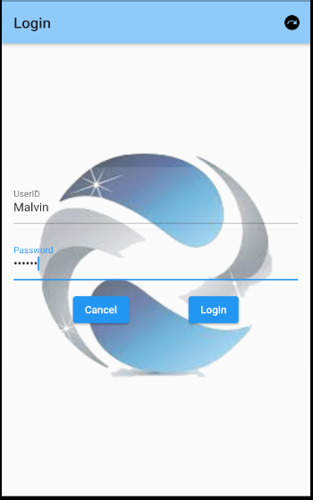
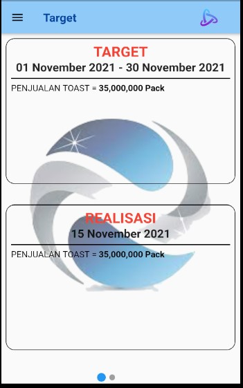

# sales_apps
Program Mobile Sales simple dengan fitur Map, dan kamera.
tanpa menggunakan database.

untuk login dapat menggunakan ID : Malvin pass : malvin

## Getting Started

program ini "TIDAK" menggunakan "DATABASE" dan hanya berfokus menggunakan list object sebagaip penyimpan datasementara.
tapi MODEL data dan provider sudah tersedia dalam bentuk yang dapat di covert dari json to list.
untuk penggunaaan nya cukup sediakan database dan link dengan REST API.
dan sesuaikan dengan nama kolom.
maka sudah dapat digunakan.

untuk penggunaan maps : cukup masukkan "GOOGLE API KEY" dengan cara search kata "google_api_key" dan "google_map_api" dan ganti dengan google api key yang ada.
